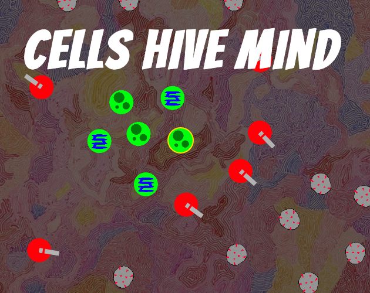
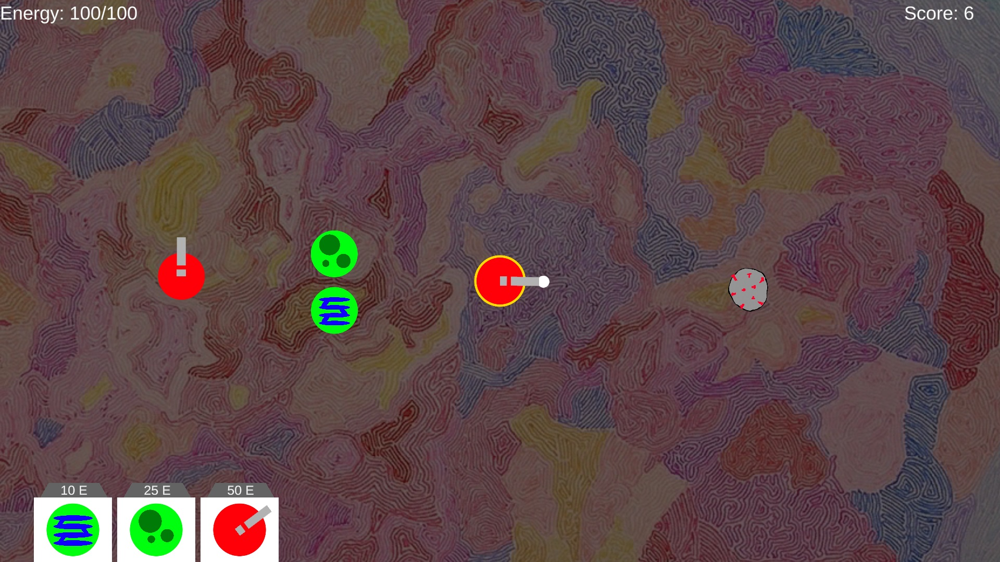
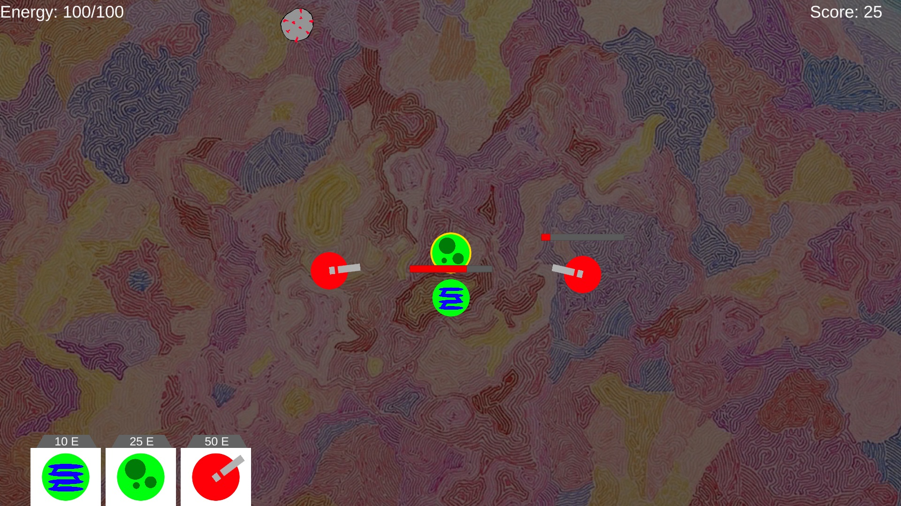
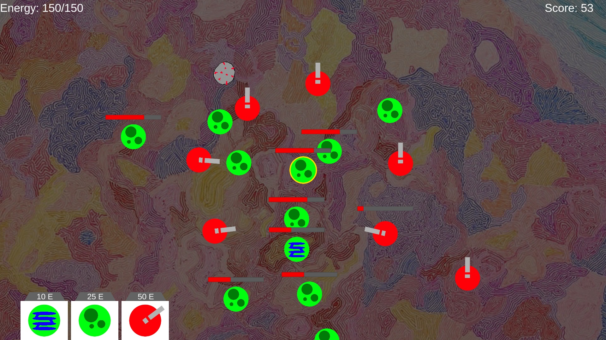

# Cells hive mind
[TriJam #62: The 3 hour game jam](https://itch.io/jam/trijam-62)  
Theme: Viral infection  

Made in 2:52 hours for TriJam-62  
You are a multicellular creature, who got attacked by virus. Survive as long as you can  

# Downloads and Links
Available in [Windows, OSX, Linux and Web](https://teamon.itch.io/cells-hive-mind). If you encounter any problem, please leave a issue! 

# How to play:
 * Press on cell to select cell. You can shoot while cannon selected
 * Build cells to produce more energy
 * Survive as long as you can

# What is TriJam?
TriJam is a jam where your goal is to try and make something playable (and fun) in only 3 hours! How is that even possible, you ask? Well, just look at the history of previous TriJams and we're sure you'll be convinced that it is not only possible, but very manageable!

# Used assets:
 * [Alena Kuznetsova](http://alenakuznetsova.com/?attachment_id=219) - background art

# Screenshots
  
  
  
